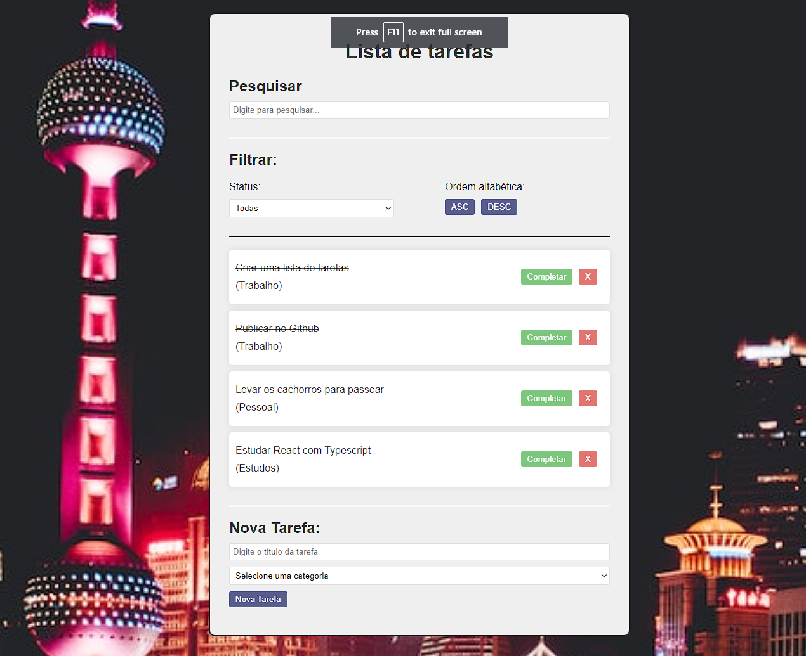

# App de TodoList em React utilizando Vite

Este é um aplicativo de TodoList escrito em React e desenvolvido usando Vite como ferramenta de construção. O aplicativo permite que você insira tarefas, marque-as como concluídas, exclua tarefas e as ordene por categoria e/ou ordem alfabética.

  
  
  
  
  

## Screenshot:

## Funcionalidades

O aplicativo de TodoList possui as seguintes funcionalidades:

- **Inserir uma task**: Você pode adicionar uma nova tarefa ao preencher o campo de entrada e pressionar o botão "Adicionar" ou pressionando Enter. A nova tarefa será exibida na lista.

- **Completar uma task**: Cada tarefa possui uma caixa de seleção à esquerda. Ao marcar a caixa, a tarefa será marcada como concluída, e seu estilo será atualizado para indicar que foi concluída.

- **Deletar uma task**: Cada tarefa também possui um botão de exclusão à direita. Ao clicar no botão de exclusão, a tarefa será removida da lista.

- **Ordenar as tasks por categoria e/ou ordem alfabética**: Você pode ordenar as tarefas por categoria clicando no botão "Ordenar por Categoria" ou ordená-las por ordem alfabética clicando no botão "Ordenar por Ordem Alfabética". Isso reorganizará a lista de tarefas de acordo com a opção selecionada.

## Pré-requisitos

Antes de executar o projeto, verifique se você possui os seguintes requisitos:

- Node.js (versão 14 ou superior)
- NPM (Node Package Manager) ou Yarn

## Executando o projeto

Siga as etapas abaixo para executar o projeto em sua máquina:

1. Clone o repositório do projeto para o seu diretório local:

`git clone https://github.com/TedMartins/ToDoList.git`

2. Navegue até o diretório do projeto:

`cd ToDoList`

3. Instale as dependências do projeto:

`nmp install`

4. Inicie o servidor de desenvolvimento:

`npm run dev`

5. O servidor de desenvolvimento será iniciado e o aplicativo estará disponível em `http://localhost:3000` ou na porta indicada em seu prompt.

## Contribuição

Contribuições são bem-vindas! Se você encontrar algum problema ou tiver sugestões para melhorias, fique à vontade para abrir uma issue ou enviar um pull request.

## Licença

Este projeto está licenciado sob a licença [MIT](https://opensource.org/licenses/MIT).